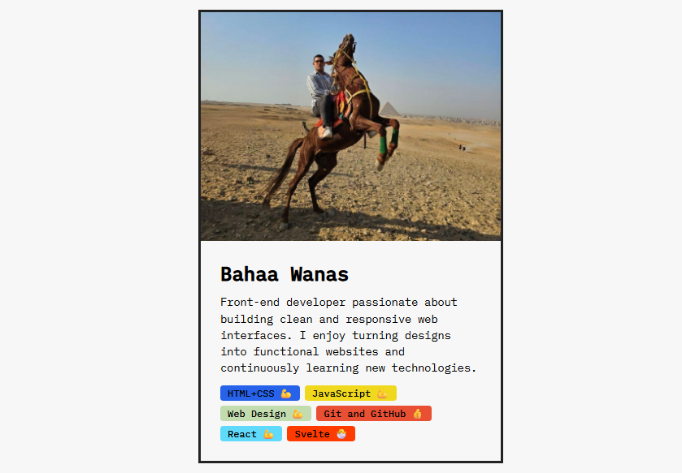

# React Developer Profile Card

A small React project that displays a developer profile card with an avatar, bio, and a list of skills.  
Each skill shows a different color and an emoji based on the proficiency level.

## Preview



## Live Demo

[View Live Project](https://bahaamedhat1.github.io/React-Developer-Profile-Card/)

## Features

- Developer profile card
- Dynamic skills list rendered with React
- Different colors for each skill
- Emoji indicators for skill levels
- Clean and simple component structure

## Built With

- React
- JavaScript (ES6+)
- CSS

## Key Concepts Used

- React Components
- Props
- Array Mapping
- Conditional Rendering
- Inline Styling

Example from the project:

```javascript
{
  skills.map((skillObj) => (
    <Skill
      skill={skillObj.skill}
      level={skillObj.level}
      bgColor={skillObj.color}
    />
  ));
}
```

## Author

**Bahaa Wanas**

- GitHub: [BahaaMedhat1](https://github.com/BahaaMedhat1)
- LinkedIn: [bahaa-wanas](https://www.linkedin.com/in/bahaa-wanas-9797b923a)
- Frontend Mentor: [BahaaMedhat1](https://www.frontendmentor.io/profile/BahaaMedhat1)
